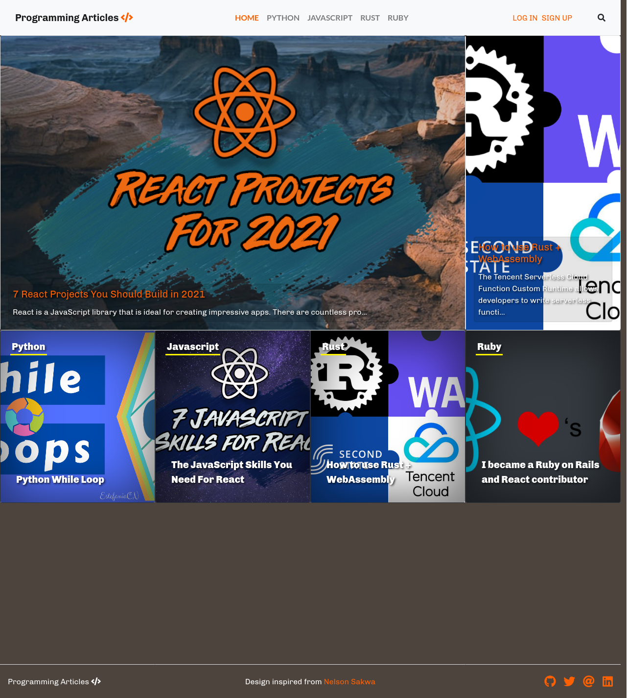

# Programming Articles

> This is a rails blogging app designed for publishing programming articles. 
> Users can create articles, categorize these articles, and vote.




- Users can log in to the app, only by typing the username.
- Users are presented with the homepage that includes:
    1. Featured article with full-width image and title in the first row. 
       This is the article with the biggest number of votes.
    2. Latest article on the website right next to the featured article.
    3. List of all categories in order of priority. Each category displayed as a square with its name on the top and its most recent article's title at the bottom. The background image is the image of the most recent article in this category.
- When the user clicks the category name they can see all articles in that category
    1. Articles are sorted by most recent.
    2. Each article displays an image, title, truncated text as a preview, and its **author name**.
    3. Users can click the *Read more* button to read the full article.
    4. Users can click the star icon to vote article.
- Each page uses the same top menu and footer
    1. Top menu has user controls and categories listed as sections.
    2. Users can click their username and see their written articles. 
- When the user opens the "*Write an article*" page:
    1. A form with all necessary fields is displayed.
    2. Users can use the rich text field to design their articles.
    
> By default it only has username authentication, but it can be easily replaceable with a devise.

## Built With

- Ruby on Rails 6.1
- Bootstrap 4.6
- Ruby 3.0
- Font Awesome

## Live Demo

[Live Demo Link](https://ror-articles.herokuapp.com/)


## Getting Started

To get a local copy up and running follow these simple example steps.

### Prerequisites
You need Ruby & Postgresql in order to run this application on your Machine

### Setup
- Install Ruby, Rails, and Postgresql to your computer by following [this](https://gorails.com/setup/) guide
### Install
- Clone this git repository.
   ```sh
       git clone https://github.com/sinansevgi/reformer.git
   ```
- Open the terminal in the project directory using 'cd programming_articles'.
- Use `bundle install` to install Ruby dependencies.
- Use `yarn install` to install Javascript dependencies.
- From the terminal run `rails db:create`
- From the terminal run `rails db:migrate`
### Usage
- You can start the server with rails s
- Visit `http://localhost:3000` from your browser


## Authors

👤 **Sinan Sevgi**

- GitHub: [@sinansevgi](https://github.com/sinansevgi)
- LinkedIn: [@sinansevgi](https://www.linkedin.com/in/sinan-s-52559437/)

## 🤝 Contributing

Contributions, issues, and feature requests are welcome!

Feel free to check the [issues page](issues/).

## Show your support

Give an ⭐️ if you like this project!

## Acknowledgments
* Design inspiration [Nelson Sakwa](https://www.behance.net/sakwadesignstudio)
* Web Framework [Rails](https://rubyonrails.org/)
* CSS Framework [Bootsrap](https://getbootstrap.com/)
* Testing [rspec rails](https://github.com/rspec/rspec-rails)
* Icons [font-awesome](https://github.com/FortAwesome/font-awesome)
* Example articles taken from the [FreeCodeCamp](https://www.freecodecamp.org/)
* Eager loading tests [bullet](https://github.com/flyerhzm/bullet)

## 📝 License

This project is [MIT](https://opensource.org/licenses/MIT) licensed.
